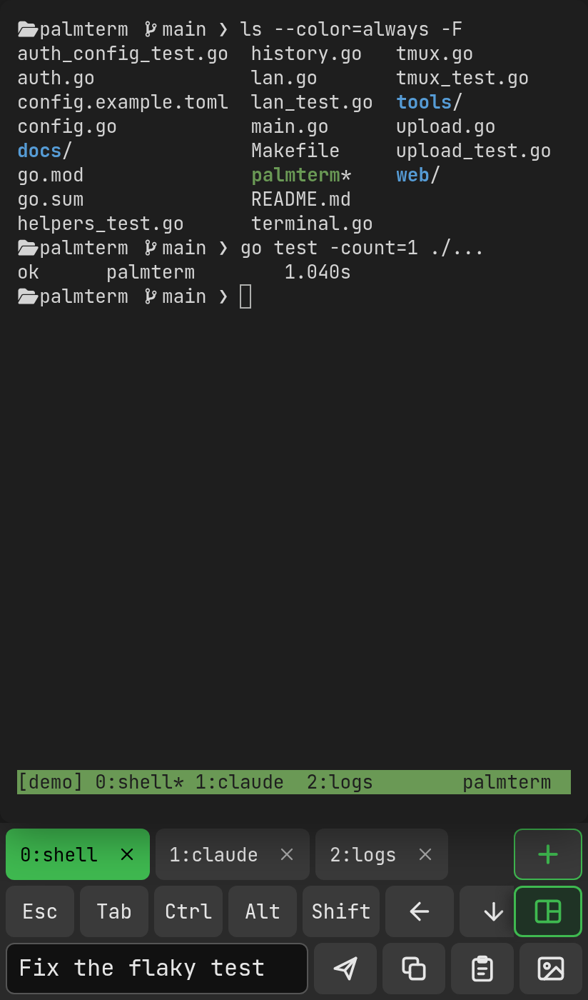

# palmterm

[English](README.md) | **日本語**

**スマホから tmux を操作する**ための Web ターミナル。タッチ画面の xterm.js では難しい、文字の選択、
Ctrl や Alt の入力、カーソル移動、スクロールを使いやすくし、vim・lazygit・Claude Code などの TUI も
スマホから扱えるようにする。

<p align="center"></p>

- 描画は [wterm](https://github.com/vercel-labs/wterm)。端末を DOM に描くので、OS の文字選択が効く。
- サーバーは画面を埋め込んだ Go の実行ファイル1つ。ブラウザごとに tmux のクライアントを1つ起動して
  同じセッションにつなぐので、PC で作業していた続きをスマホからそのまま触れる。

## できること

### 入力

- **テキストボックス**（下に常に出ている）：OS のキーボードで編集してから送る。カーソル移動・IME・
  予測変換・音声入力がそのまま使える。
  - Enter は改行。送信ボタン、Ctrl+Enter（⌘+Enter）、またはキーバーの Ctrl を押してから Enter で送る。
    複数行はブラケットペーストで送るので、Claude Code には複数行のまま入る。
  - 空のときの Backspace は端末側の文字を消す。
- **直接入力**：端末をタップして打つと、1文字ずつすぐ端末に送る（vim や TUI 向け）。
- Tab・貼り付け・画像は、最後に入力していた方に効く。

### キーバー

- 既定は Esc、Tab、Ctrl/Alt/Shift、矢印、Enter、^C、^D、Home/End、PgUp/PgDn といくつかの記号。
  キーと並びは設定ファイルで変えられる（[設定ファイル](#設定ファイル)）。
- **修飾キー**：1回押すと次のキーに1回だけ効く（緑の枠）。すばやく2回押すと固定（緑の塗りつぶし）。
  もう一度押すと解除。ソフトキーボードで打った文字にも効く。
- 矢印と PgUp/PgDn は押し続けると繰り返す。矢印はアプリのカーソルキーのモード（DECCKM）に合わせて送る。
- キーバーを押してもソフトキーボードは出さない。出ているときは閉じない。

### tmux のウィンドウとペイン

- **ウィンドウのタブ**（キーバーの上に常に出す）：タップで切り替え、**＋** で今のディレクトリに新しい
  ウィンドウ、**×** で閉じる（2回押し）。今いるタブをもう一度タップすると名前を変えられる（空にすると
  tmux の自動の名前に戻す）。
- **緑の tmux ボタン**（キーバーの右端に固定）：ペインの分割、拡大、閉じる（2回押し）、ペインの移動、
  tmux のコピーモード、プレフィックス（Ctrl+B）の送信、文字サイズの変更ができるパネルを開く。
- **ペインをタップ**すると、そのペインに移る。
- これらはサーバーが tmux のコマンドで直接行うので、プレフィックスやキーの割り当てを変えていても、
  tmux の `mouse` が off でも動く。

### スクロールとジェスチャー

- **縦にスワイプ**してスクロールする。スワイプを始めたときのペインの状態で動きを変える。
  - シェルや Claude Code など（マウスも全画面も使っていない）、tmux のコピーモード中：tmux の履歴を
    さかのぼる。一番下まで戻すとコピーモードを抜ける。
  - マウスを使うアプリ（vim・lazygit など）：ホイールを送る。
  - 全画面でマウスを使わないアプリ（less など）：↑↓ を送る。
  - 指を離したあとも、速さに応じて少し続く。
- **ピンチ**で文字サイズを変える（8〜32px）。

### コピーと貼り付け

- **コピー**（重なった2枚の紙のボタン）：tmux の履歴（3000 行）を普通のテキストとして出す。長押しで
  選び、「選択をコピー」か「入力欄へ」。
- **貼り付け**（クリップボードのボタン）：テキストボックスか端末に貼り付ける。ブラウザは HTTPS のとき
  しか許さないので、HTTP のときはテキストボックスを長押しして貼り付ける。

### 画像（Claude Code 向け）

- 画像のボタンで写真を選ぶか、テキストボックスや端末に画像を貼り付けると、サーバーに保存する
  （既定は `~/.cache/palmterm/uploads`）。
- Claude Code が読めない形式（HEIC・AVIF など）は、ffmpeg で JPEG に変換する。
- テキストボックスに入力しているときは、その上にサムネイルが並ぶ（× で外せる）。送信すると、
  アップロードが終わるのを待ってから画像のパスを1枚ずつ貼り付け、文章、Enter の順に送る。Claude Code
  では `[Image #1]` のように添付される。アップロードに失敗した画像があれば、何も送らずに知らせる。
- 端末に直接入力しているときは、アップロードが終わりしだいパスを貼り付ける。

### フォント

- JetBrains Mono と Symbols Nerd Font Mono を palmterm が配るので、スマホでも Nerd Font のアイコンが出る。
- WezTerm・kitty・Ghostty と同じく、次のマスが空白のアイコンは2マス分の大きさで描き、そうでなければ
  1マスに収める。Powerline の区切りは1マスいっぱいに引き伸ばす。

### その他

- 切断されても tmux のセッションは残り、つなぎ直すと続きから表示される。
- 画面の言語は英語と日本語。

## 必要なもの

- Linux（Fedora で確認）など、PTY のある Unix
- tmux 3.x
- ビルドに Go 1.26 以降と Node.js 22 以降
- ffmpeg（任意。HEIC などを Claude Code 向けに変換する）
- Chromium（通しのテストにだけ使う）

## 使い方

```sh
git clone https://github.com/MoomA-0750/palmterm.git
cd palmterm
make          # 画面をビルドして ./palmterm を作る
./palmterm    # 127.0.0.1:7681 で待ち受け、ログイン用の URL を表示する
```

表示された `http://127.0.0.1:7681/auth?token=…` を一度開けば、以後そのブラウザはログインしたままになる。
つなぐ tmux のセッションは `main`（なければ作る）。

### スマホから

**Tailscale（おすすめ）**：palmterm は 127.0.0.1 のままにして、Tailscale に tailnet の中だけ HTTPS で
公開させる。

```sh
tailscale serve --bg 7681
```

**LAN**：LAN 向けに HTTPS でも待ち受ける。

```sh
./palmterm -lan :7682
```

この PC の LAN の IPv4 アドレス（と Tailscale のアドレス）ごとに待ち受け、`https://<アドレス>:7682/auth?token=…`
を表示する。アドレスを書けば（`-lan 192.168.1.5:7682`）そのアドレスだけで待ち受ける。証明書は自分で署名した
ものを `~/.config/palmterm/` に作る（新しい IP アドレスが出てきたら、前のアドレスも残して作り直す）ので、
ブラウザは最初に警告を出す。「詳細設定」から先へ進む。LAN 側を HTTPS にしているのは、トークンを平文で流さないためと、貼り付け
ボタンを使えるようにするため。

### オプション

| オプション | 既定 | |
|---|---|---|
| `-listen` | `127.0.0.1:7681` | 待ち受けるアドレス（HTTP） |
| `-lan` | なし | LAN 向けに HTTPS でも待ち受けるアドレス（例 `:7682`） |
| `-session` | `main` | つなぐ tmux のセッション |
| `-token` | `~/.config/palmterm/token` | ログイン用のトークン（`PALMTERM_TOKEN` でも可）。最初の起動でランダムに作る |
| `-config` | `~/.config/palmterm/config.toml` | 設定ファイル |
| `-upload-dir` | `~/.cache/palmterm/uploads` | アップロードした画像の保存先 |
| `-allow-origin` | | WebSocket を許す別の Origin（開発用の Vite など） |

## 設定ファイル

`~/.config/palmterm/config.toml` で、画面の言語とキーバーを決める。書き換えたらページを読み込み直すだけで
反映する（再起動は要らない）。[config.example.toml](config.example.toml) に既定のキーバーがそのまま
書いてあるので、コピーして編集するとよい。

```toml
language = "ja"        # "en"（既定）か "ja"

[[keys]]
key = "esc"

[[keys]]
mod = "ctrl"           # 修飾キー

[[keys]]
key = "shift+tab"      # 組み合わせ
label = "S-Tab"

[[keys]]
text = ":wq\r"         # そのまま送る文字
label = ":wq"
```

`[[keys]]` の1つ1つには、次のどれか1つを書く。

| | |
|---|---|
| `key` | 特殊キーか1文字に、修飾キーを `+` でつないだもの。特殊キー：`esc` `tab` `enter` `backspace` `delete` `insert` `up` `down` `left` `right` `home` `end` `pageup` `pagedown` `f1`〜`f12` `space`。修飾キー：`ctrl`、`alt`（`meta` でも可）、`shift`。例：`ctrl+c`、`alt+left`、`ctrl+space`、`ctrl++` |
| `mod` | `ctrl`・`alt`・`shift`。修飾キーのボタンになる |
| `text` | そのまま送る文字（`\r` や `\u001b` のような TOML のエスケープが使える） |

省略できるもの：`label`、`icon`（`left` `right` `up` `down` `backspace` `enter` `close` `plus`
`splitH` `splitV` `maximize` `cycle` `panes` `textSmaller` `textLarger`）、`repeat`。
キーは書いた順に左から並び、`[[keys]]` を1つでも書くと既定の並びを丸ごと置き換える。書き間違い
（知らない項目・キー・アイコン）は画面を開いたときに知らせ、それ以外はそのまま使える。

## セキュリティ

palmterm にログインした人は、**この PC のシェルを使える**。外に漏らさないこと。

- トークンは1つだけで、`~/.config/palmterm/token`（権限 0600）に保存し、再起動しても変わらない。
  トークン入りのログイン用 URL を起動時に表示するので、journal などのログにも残る。
- `/auth?token=…` を開くと、1年間有効な Cookie（HttpOnly、SameSite=Lax、HTTPS なら Secure）を入れる。
  Cookie の中身はトークンそのものではなく、トークンから計算した値（HMAC-SHA256）。画面・API・WebSocket の
  すべてでこれを確かめ、WebSocket はさらに Origin も確かめる。
- ブラウザは Cookie を同じホスト名のすべてのポートに送るので、同じホストで開いたほかのサービス
  （`127.0.0.1` の別のポートの開発用サーバーなど）にも Cookie が届く。それを使えばあなたとして palmterm を
  操作できるが、別の端末でログインすることはできない。
- 比較は、かかる時間から中身を推測されない方法で行う。ログアウトや端末ごとの取り消しはない。
  全端末を締め出すには、トークンのファイルを消して（または `-token` で別の値にして）再起動する。
- 既定では 127.0.0.1 でしか待ち受けない。`-lan :7682` も、すべてのネットワークではなく、この PC の LAN
  （と Tailscale）の IPv4 アドレスだけで待ち受ける。インターネットには公開しないこと。
- アップロードしたファイルは `X-Content-Type-Options: nosniff` と `Content-Security-Policy: sandbox` を付けて返す。

## 開発

```sh
make dev    # Go のサーバー（7681）と Vite（5173）を起動。http://localhost:5173/auth?token=… を開く
make test   # Go のテスト、画面の単体テスト（vitest）、Chromium での通しのテスト（playwright-core）
```

- tmux を使うテストは、テスト専用の tmux サーバー（`TMUX_TMPDIR` を分け、シェルは `/bin/sh`）で動かすので、
  ふだんのセッションには触れない。通しのテストは `/usr/bin/chromium` を使う（`CHROMIUM=…` で変えられる）。
- `cd web && npm run screenshot` で、同じく切り離した環境で `docs/screenshot.png` を撮り直せる。
- `tools/fit-nerd-symbols.py` は、Symbols Nerd Font Mono から `web/src/fonts/` のアイコン用フォントを作り直す。

## ライセンス

[MIT](LICENSE)

使っているもの：[wterm](https://github.com/vercel-labs/wterm)（Apache-2.0）、
[JetBrains Mono](https://github.com/JetBrains/JetBrainsMono)（OFL-1.1）、
[Nerd Fonts](https://github.com/ryanoasis/nerd-fonts) のシンボル（MIT。`web/src/fonts/SymbolsNerdFont-LICENSE`）、
[coder/websocket](https://github.com/coder/websocket)（ISC）、[creack/pty](https://github.com/creack/pty)（MIT）、
[BurntSushi/toml](https://github.com/BurntSushi/toml)（MIT）。
